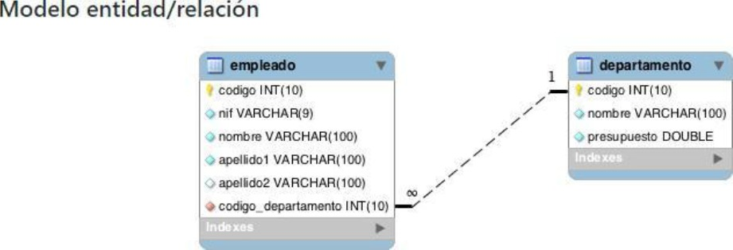

# lexerTechnicalTest

lexer Technical Test

PRUEBA DE DESARROLLO COBRANDO BPO

1. Teniendo en cuenta el siguiente modelo elabore un micro servicio para la tabla
“empleado” el cual sea capaz de insertar, actualizar, borrar y consultar (CRUD)
información utilizando el entorno de Node.js:
# Screenshot

El micro servicio tiene que interactuar con una DB de tipo POSTGRESQL Por medio de un
ORM, además de esto, es un plus si realiza el montaje por medio de Docker, aunque no es
completamente necesario, su micro servicio tiene que estar disponible por el puerto 1234
además de tener las indicaciones pertinentes de uso.