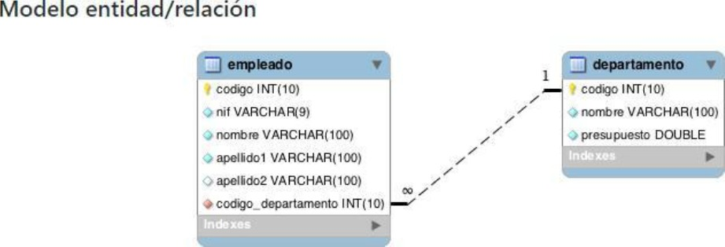

# lexerTechnicalTest

lexer Technical Test

PRUEBA DE DESARROLLO COBRANDO BPO

1. Teniendo en cuenta el siguiente modelo elabore un micro servicio para la tabla
“empleado” el cual sea capaz de insertar, actualizar, borrar y consultar (CRUD)
información utilizando el entorno de Node.js:
# Screenshot

El micro servicio tiene que interactuar con una DB de tipo POSTGRESQL Por medio de un
ORM, además de esto, es un plus si realiza el montaje por medio de Docker, aunque no es
completamente necesario, su micro servicio tiene que estar disponible por el puerto 1234
además de tener las indicaciones pertinentes de uso.

# Solucion 

1.primero se establecio el servidor con express, porteior a esto implementamos la estructura Mvc, conectando asi nuestro Entry Point"index.js" con las "routes/tasks.routes.js"
se establecen las diferentes rutas con la conexion al controlador y los diferentes metodos, en el controlador desarrollamos la logica del api y sus metodos de peticion http "CRUD" con sentencias "SQL", toda la informacion que consume nuestra api es extraida del archivo "db" alojada en la constante "const pool = require("../db");" en el archivo db se definen las credenciales las cuales nos ayudaran a conectarnos con nuestra base de datos, de forma segura sin revelar informacion sensible, gracias al archivo .env, los datos de nuestra api los consumira el frontend el cual se encuentra en la carpeta "client" desarrollado en react.

2.